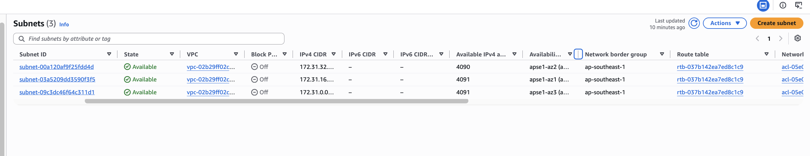
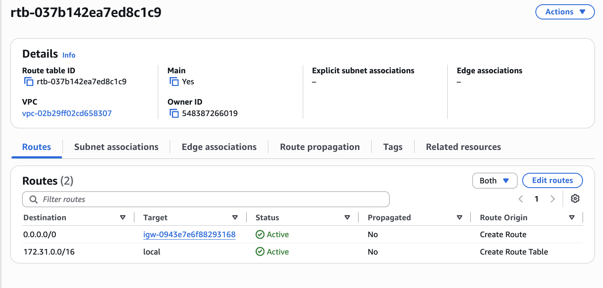
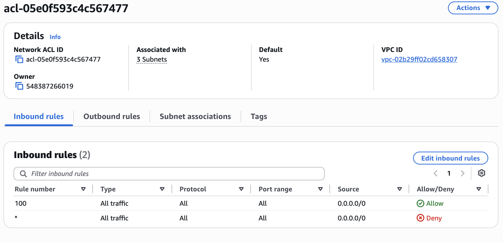
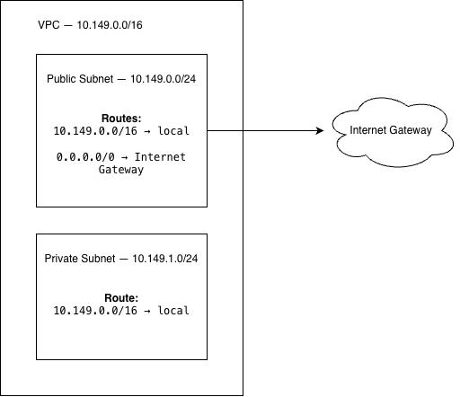

# Assignment 2 Submission

<!--

How to use this template:

1. Copy this file to submissions/assignment-2/<your-github-username>/submission.md

2. Replace every answer placeholder with your own answer. Delete the angle brackets too.

3. Save your four images in the same folder, with the exact file names below.

4. Do not write your full name or your student number in this file.

-->

## About me

- GitHub username: bewoop

- Section: III-ACSAD

- IAM user name that I signed in with: acsad-06 

- X: 149

---

## Part A. Explore

### A1. The VPC

Default VPC IPv4 CIDR:

172.31.0.0/16

Number of addresses in that CIDR:

65,536

### A2. The subnets

| Availability Zone | IPv4 CIDR |
| --- | --- |
| ap-southeast-1a | 172.31.32.0/20 |
| ap-southeast-1b | 172.31.16.0/20 |
| ap-southeast-1c | 172.31.0.0/20 |

Screenshot 1. Save it as `screenshot-1-subnets.png` in your folder. The image line below shows it.

### A3. Available addresses

Available IPv4 addresses in each subnet:

172.31.32.0/20: 4,090  
172.31.16.0/20: 4,091  
172.31.0.0/20: 4,091

Why is the number lower than 4,096?

AWS reserves five IPv4 addresses in each subnet for network functions, leaving 4,091 usable addresses.

What uses the missing address in the subnet with the lowest number?

The subnet 172.31.32.0/20 has 4,090 available addresses because one additional IPv4 address is being used by the EC2 resource `umak-elec3-week3-demo`.

### A4. The route table

| Destination | Target |
| --- | --- |
| 0.0.0.0/0 | Internet Gateway |
| 172.31.0.0/16 | local |

Screenshot 2. Save it as `screenshot-2-routes.png` in your folder. The image line below shows it.

### A5. Public or private

Are the default subnets public or private? Which route proves it?

The default subnets are public because they use the main route table, which has a `0.0.0.0/0` route to the Internet Gateway.

### A6. The internet gateway

State of the internet gateway:

Attached

What happens to the default subnets if the gateway is detached?

Resources in the default subnets would no longer be able to communicate with the Internet through the Internet Gateway.

### A7. NAT gateways

Number of NAT gateways:

0

Can a server in a new private subnet download updates? Why?

No. The VPC has no NAT gateway, so a server in a private subnet would not have a way to access the Internet for downloading updates.

### A8. The network ACL

| Rule number | Source | Allow or Deny |
| --- | --- | --- |
| 100 | 0.0.0.0/0 | Allow |
| * | 0.0.0.0/0 | Deny |

How is a network ACL different from a security group?

A network ACL controls traffic at the subnet level, while a security group controls traffic at the instance or resource level. A network ACL is stateless, while a security group is stateful.

Screenshot 3. Save it as `screenshot-3-network-acl.png` in your folder. The image line below shows it.

### A9. The default security group

Inbound rule (type and source):

All traffic from the default security group (`sg-0c5b6d4081cf0a534`).

Which resources can send traffic to an instance that uses it?

Resources that are associated with the same default security group can send traffic to an instance that uses it.

---

## Part B. Prepare

### B1. Plan two subnets

- Public subnet CIDR: 10.149.0.0/24

- Private subnet CIDR: 10.149.1.0/24

### B2. Route tables

Route table of the public subnet:

| Destination | Target |
| --- | --- |
| 10.149.0.0/16 | local |
| 0.0.0.0/0 | Internet Gateway |

Route table of the private subnet:

| Destination | Target |
| --- | --- |
| 10.149.0.0/16 | local |

### B3. My VPC diagram

Tool used (Excalidraw, draw.io, Lucidchart, or paper):

draw.io

Save your diagram as `vpc-diagram.png` in your folder. The image line below shows it.

### B4. Predict a change

Can you still open the web page from your laptop? Why?

No. If the `0.0.0.0/0` route is deleted, there is no default route to the Internet Gateway, so the laptop can no longer access the instance's web page.

Can the instance still reach another instance in the VPC? Why?

Yes. The instance can still communicate with another instance in the same VPC because the `10.149.0.0/16` local route remains in the route table.

### B5. Place a database

Which subnet gets the database? Why?

The database should be placed in the private subnet because it does not have a route to the Internet Gateway, providing greater isolation from direct Internet access.

### B6. My question about VPCs

What is your question, and what made you think of it?

Can a private subnet communicate with a public subnet within the same VPC without using an Internet Gateway? This question came from comparing the routes of the public and private subnets and noticing that both can use the local route for communication within the VPC.